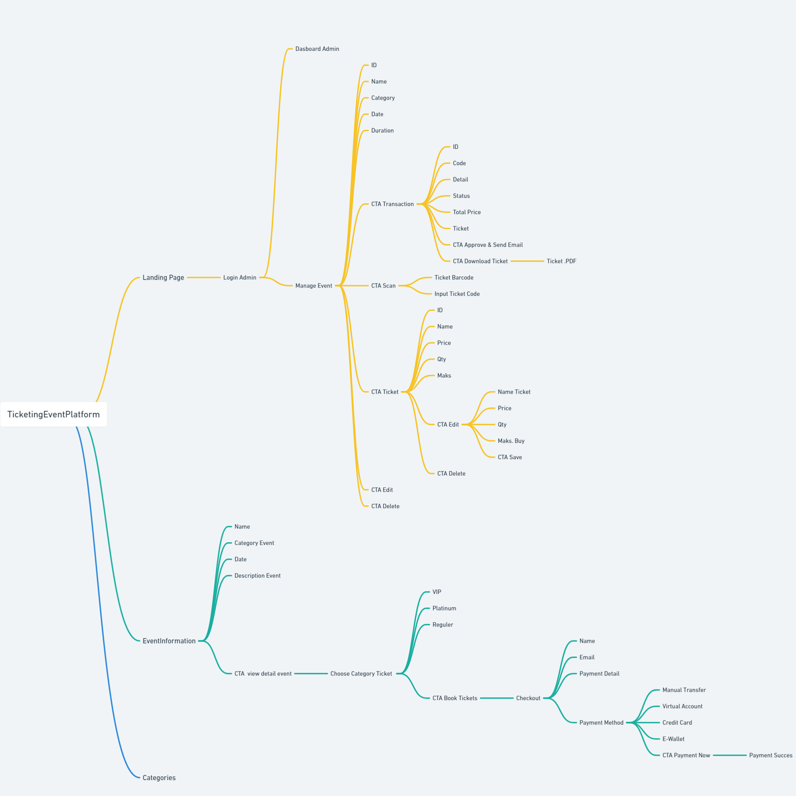
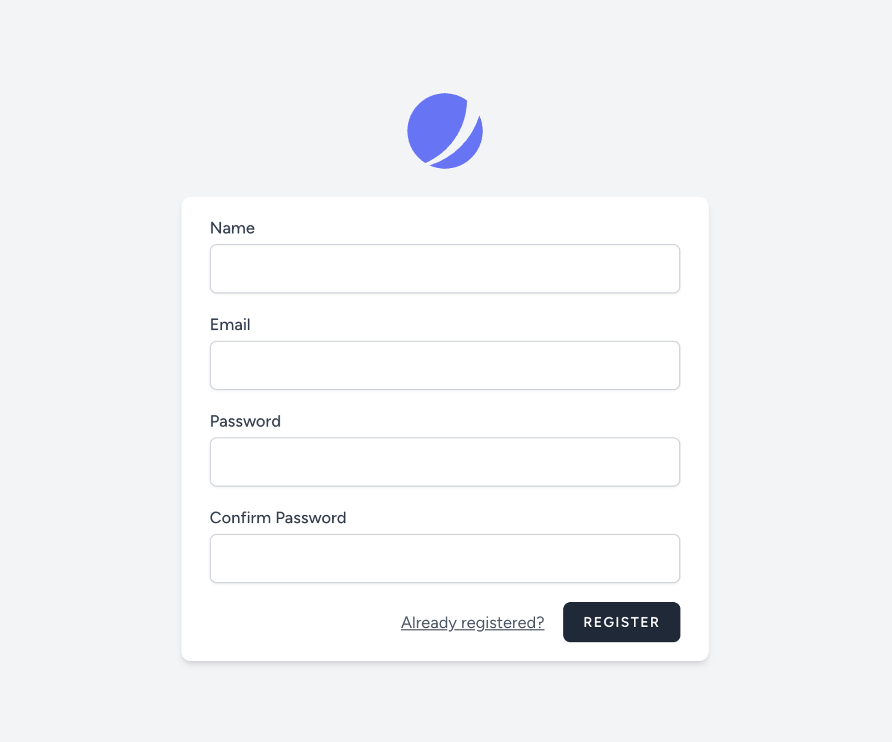
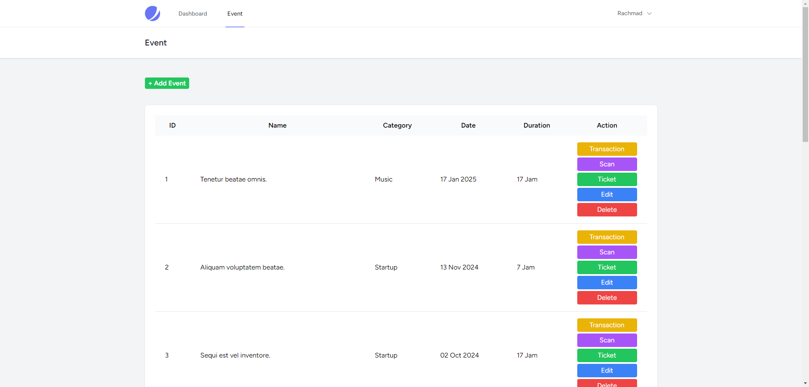
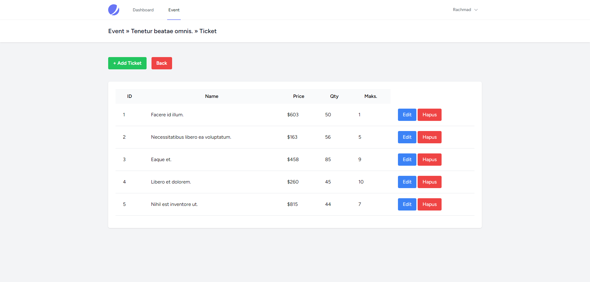
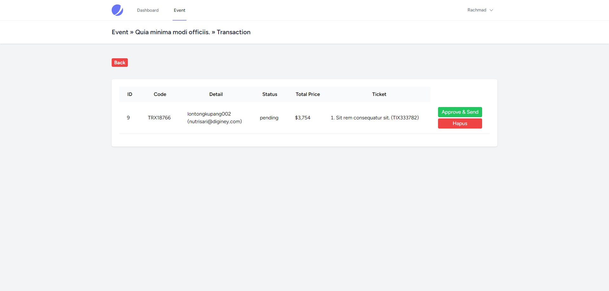
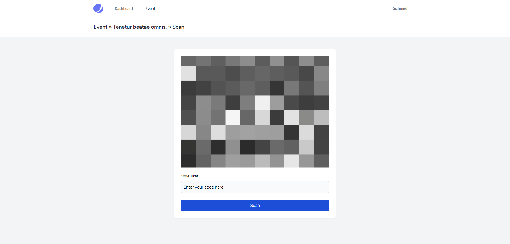
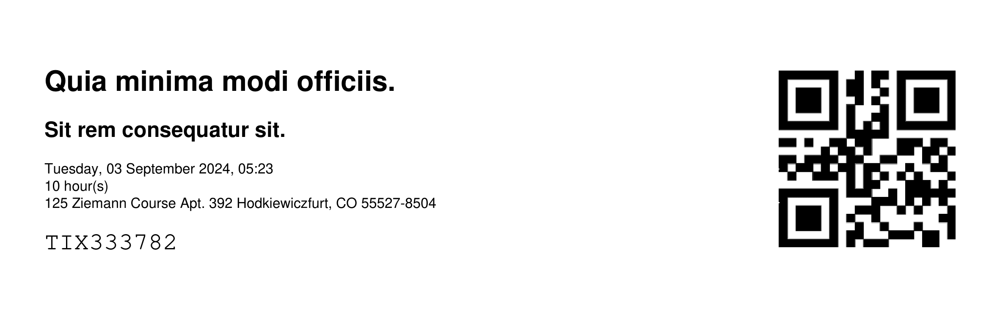

## Repository Description

### Event Ticket Sales System with CMS, PDF Ticket Generation, and Barcode Scanning
### Registration Page Explanation

Event Ticket Sales System with CMS, PDF Ticket Generation, and Barcode Scanning. Manage events, generate PDF tickets with unique barcodes, and validate tickets in real-time using SimpleSoftwareIO/simple-qrcode. Built with Laravel and Vue.js. Easy to install, configure, and use. Contributions welcome!

### Key Features

- **Content Management System (CMS):**
  - Easily manage various types of events.
  - Create, edit, and delete events.
  - Set event details such as description, location, date, and time.

- **PDF Ticket Generation:**
  - Automatically generate tickets in PDF format.
  - Each ticket includes essential information such as event name, attendee details, and a unique barcode.

- **Barcode Scanning:**
  - Validate tickets using barcode scanning.
  - Scanning can be done via mobile applications or barcode scanning devices.
  - Real-time validation process to ensure ticket authenticity.

### Technologies Used

- **Backend:** Laravel
- **Frontend:** Tailwind CSS
- **Database:** MySQL
- **Barcode:** SimpleSoftwareIO/simple-qrcode for barcode generation and scanning
- **PDF Generation:** DomPDF for Laravel
- **FakerPhP:** PHP library that generates fake data for you. Whether you need to bootstrap database.

## User Flow Overview

  
### Skema Database

### Registration Page Explanation

The registration page is designed for administrators to create their accounts. Here are the key components and their purposes:
### Name Field
- **Label**: "Name"
- **Input Type**: Text
- **Description**:  
  The administrator should enter their full name in this field. This will be used to personalize their experience and may be displayed in various parts of the application.

### Email Field
- **Label**: "Email"
- **Input Type**: Email
- **Description**:  
  The administrator should enter a valid email address. This email will be used for account-related communications and to recover the password if needed.

### Password Field
- **Label**: "Password"
- **Input Type**: Password
- **Description**:  
  The administrator should create a strong password to secure their account. This password must meet the application's security requirements (e.g., minimum length, inclusion of special characters, etc.).

### Confirm Password Field
- **Label**: "Confirm Password"
- **Input Type**: Password
- **Description**:  
  The administrator should re-enter the same password as in the Password Field. This is to ensure that there are no typos in the password, providing an additional layer of confirmation.

### Admin Dashboard Section Overview

  <table style="width:80%; border: 1px solid #ddd; border-collapse: collapse;">
    <thead>
      <tr>
        <th style="width:50%; padding: 10px; border: 1px solid #ddd;">Table Columns</th>
        <th style="width:50%; padding: 10px; border: 1px solid #ddd;">Button</th>
      </tr>
    </thead>
    <tbody>
      <tr>
        <td style="vertical-align:top; padding: 10px; border: 1px solid #ddd;">
          <ol>
            <li>ID: Unique identifier for each entry.</li>
            <li>Name: Name of the entry (e.g., event or user).</li>
            <li>Category: Classification of the entry.</li>
            <li>Date: Relevant date for each entry.</li>
            <li>Duration: Period related to the entry.</li>
          </ol>
        </td>
        <td style="vertical-align:top; padding: 10px; border: 1px solid #ddd;">
          <ol>
            <li>Transaction: View/manage transactions for the entry.</li>
            <li>Scan Ticket: Scan and validate tickets.</li>
            <li>Edit: Modify entry details.</li>
            <li>Delete: Remove the entry after confirmation.</li>
          </ol>
        </td>
      </tr>
    </tbody>
  </table>

### Admin Ticket Section Overview

This description explains the function and use of each column in the ticket table in detail.
- **ID**
  - Unique identifier for each ticket.
  - Used for tracking and managing tickets in the system.

- **Name**
  - Name or title of the ticket.
  - Provides a description of the event or product associated with the ticket.

- **Price**
  - Cost of the ticket.
  - Displayed to users as the price they need to pay to acquire the ticket.

- **Quantity**
  - Number of tickets available for purchase.
  - Helps manage and display ticket availability to users.

- **Max**
  - Maximum number of tickets that can be purchased or issued.
  - Enforces limits on ticket purchases to prevent overselling.

### Admin Transaction Approve Section Overview

This section explains the function and use of each column and action button on the transaction page.

- **ID**
  - **Description**: Unique identifier for the transaction.
  - **Purpose**: Used for tracking and managing each transaction in the system.

- **Ticket Code**
  - **Description**: Code assigned to the ticket.
  - **Purpose**: Used for validation and identification purposes.

- **Detail**
  - **Description**: Information about the transaction.
  - **Purpose**: Includes details about the event or product purchased.

- **Status**
  - **Description**: Current status of the transaction (e.g., Pending, Approved, Completed).
  - **Purpose**: Indicates the state of the transaction.

- **Total Price**
  - **Description**: Total cost of the transaction.
  - **Purpose**: Displays the amount to be paid for the ticket(s) purchased.

- **Actions**
  - **Approve**: Mark the transaction as approved and confirm the purchase.
  - **Send via Email**: Send transaction details and ticket information to the user's email.
  - **Delete**: Remove the transaction from the system after confirmation.

### Admin Scan Barcode Section Overview

  <table style="width:80%; border: 1px solid #ddd; border-collapse: collapse;">
    <thead>
      <tr>
        <th style="width:20%; padding: 10px; border: 1px solid #ddd;">Component</th>
        <th style="width:80%; padding: 10px; border: 1px solid #ddd;">Description</th>
      </tr>
    </thead>
    <tbody>
      <tr>
        <td style="vertical-align:top; padding: 10px; border: 1px solid #ddd;">
          <h3>Barcode Scanner Interface</h3>
        </td>
        <td style="vertical-align:top; padding: 10px; border: 1px solid #ddd;">
          
Provides an interface for scanning barcodes using a connected scanner or mobile device camera. This tool enables quick validation of tickets by capturing and processing barcode data.

        </td>
      </tr>
      <tr>
        <td style="vertical-align:top; padding: 10px; border: 1px solid #ddd;">
          <h3>Ticket Input Field</h3>
        </td>
        <td style="vertical-align:top; padding: 10px; border: 1px solid #ddd;">
          
<strong>Label:</strong> "Ticket Code"

          
<strong>Input Type:</strong> Text

          
<strong>Description:</strong> Allows administrators to manually enter a ticket code if barcode scanning is not feasible. This field provides an alternative for verifying tickets when the scanner is unavailable or malfunctioning.

        </td>
      </tr>
      <tr>
        <td style="vertical-align:top; padding: 10px; border: 1px solid #ddd;">
          <h3>Scan Button</h3>
        </td>
        <td style="vertical-align:top; padding: 10px; border: 1px solid #ddd;">
          
<strong>Label:</strong> "Verify Ticket"

          
<strong>Function:</strong> Submits the scanned or entered ticket code for processing. It triggers the system to look up the ticket details and display the relevant information for validation.

        </td>
      </tr>
      <tr>
        <td style="vertical-align:top; padding: 10px; border: 1px solid #ddd;">
          <h3>Ticket Information Display</h3>
        </td>
        <td style="vertical-align:top; padding: 10px; border: 1px solid #ddd;">
          
Displays detailed information about the ticket after scanning or entry. Includes:

          <ul>
            <li><strong>Ticket ID:</strong> Unique identifier for the ticket.</li>
            <li><strong>Event Name:</strong> Name of the event associated with the ticket.</li>
            <li><strong>Attendee Name:</strong> Name of the person who holds the ticket.</li>
            <li><strong>Status:</strong> Current status of the ticket (e.g., Valid, Invalid, or Used).</li>
            <li><strong>Additional Details:</strong> Other relevant information about the ticket.</li>
          </ul>
        </td>
      </tr>
      <tr>
        <td style="vertical-align:top; padding: 10px; border: 1px solid #ddd;">
          <h3>Error Handling</h3>
        </td>
        <td style="vertical-align:top; padding: 10px; border: 1px solid #ddd;">
          
Handles issues related to ticket scanning and validation:

          <ul>
            <li><strong>Invalid Ticket:</strong> Displays an error message if the ticket code is not found or invalid.</li>
            <li><strong>Scanning Issues:</strong> Provides an error message and prompts for manual entry if there are problems with the barcode scanner.</li>
          </ul>
        </td>
      </tr>
    </tbody>
  </table>

### Ticket Simple Design Overview

## Ticket Table Columns

This section describes the function and purpose of each column in the ticket table.

- **ID**
  - Unique identifier for each ticket. This ID helps track and manage individual tickets.

- **Name**
  - The name of the event or product the ticket is for.

- **Price**
  - Cost of the ticket. Displays the price to be paid.

- **Quantity**
  - Number of tickets available or purchased.

- **Maximum**
  - Maximum number of tickets that can be bought or allocated.

### Usage

1. **Installation:**
   - Clone this repository: `git clone https://github.com/username/event-ticket-system.git`
   - Navigate to the project directory: `cd event-ticket-system`
   - Install dependencies: `composer install` and `npm install`
   - Configure the `.env` file according to your database and application settings.
   - Migrate the database: `php artisan migrate`
   - Start the server: `php artisan serve`

2. **Event Management:**
   - Log in to the CMS and create a new event.
   - Enter all necessary event information.
   - Save the event, and the system will generate PDF tickets that are ready for distribution.

3. **Ticket Validation:**
   - Use a mobile application or barcode scanning device to scan tickets upon attendee arrival.
   - The system will validate the ticket and display its authenticity status in real-time.

  
### Contribution

I welcome contributions from developers interested in enhancing this system. Please open an issue or a pull request to get started.
